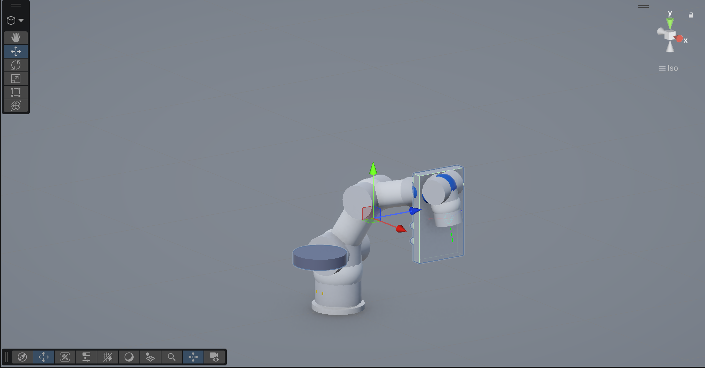

# 반도체 장비 시뮬레이터

반도체 장비의 동작 원리와 자동화 흐름을 Unity 기반 3D 시뮬레이션으로 학습할 수 있는 교육용 오픈소스 프로젝트입니다.

이 프로젝트는 학생, 교사, 교수자, 현장 엔지니어, 장비 자동화 입문자가 반도체 장비의 구조와 동작을 직접 보고 조작하며 이해할 수 있도록 만드는 것을 목표로 합니다. 실제 장비를 사용하기 어려운 교육 환경에서도 로봇 이송, 웨이퍼 핸들링, 충돌 감지, 티칭 동작 같은 핵심 개념을 실습형 콘텐츠로 다룰 수 있습니다.

## 활용 대상

- 반도체, 메카트로닉스, 자동화, 로봇 관련 학과 수업
- 마이스터고, 특성화고, 전문대, 대학 실습 교육
- 기업 신입 엔지니어 교육 및 직무 전환 교육
- 반도체 장비 제어, 설비 자동화, 디지털 트윈 기초 실습
- Unity 기반 산업 시뮬레이션 학습 자료 제작

## 주요 목표

- 반도체 장비의 기본 동작을 시각적으로 이해할 수 있게 만들기
- 장비 내부의 로봇 이송, 웨이퍼 이동, 안전 인터락 개념을 실습화하기
- 교육기관과 기업이 자유롭게 수정하고 확장할 수 있는 오픈소스 기반 제공
- 실제 장비 투입 전 사전 교육, 데모, PoC에 활용할 수 있는 시뮬레이터 구축

## 현재 포함된 기능

- Unity `6000.5.3f1` 기반 프로젝트
- 6축 로봇 형태의 디지털 트윈 시뮬레이션
- 로봇 조그 UI 및 티칭/재생 흐름
- 웨이퍼 이송 시나리오
- 충돌 감지 기반 E-STOP 안전 모니터
- 샘플 Unity 씬
- 시뮬레이터 기획 및 로드맵 문서

## 실행 화면



## 실행 환경

- Unity `6000.5.3f1`
- Git

Unity 버전은 아래 파일에서 확인할 수 있습니다.

```text
ProjectSettings/ProjectVersion.txt
```

## 설치 및 실행

저장소를 클론합니다.

```powershell
git clone https://github.com/jacksimuse/semiconductor-equipment-simulator.git
```

Unity Hub에서 클론한 폴더를 열고 Unity `6000.5.3f1` 버전으로 실행합니다.

## 저장소 구성 참고

Unity가 자동 생성하는 `Library`, `Temp`, `Logs`, `UserSettings` 폴더는 Git에 포함하지 않습니다.

프로젝트 인수인계 정보는 아래 문서를 참고하세요.

```text
HANDOFF.md
```

교육 및 납품 준비 문서는 아래 파일을 참고하세요.

```text
docs/delivery-package.md
docs/training-plan.md
```

## 교육 및 납품 활용 방향

이 프로젝트는 오픈소스로 공개되어 있으며, 교육기관과 기업 현장에 맞게 커리큘럼, 실습 과제, 장비 모델, UI, 시나리오를 확장할 수 있습니다.

납품형 구성 예시는 다음과 같습니다.

- 교육용 시뮬레이터 실행 파일
- Unity 원본 프로젝트
- 강사용 수업 자료
- 학생용 실습 매뉴얼
- 과제 및 평가 문항
- 기관 맞춤형 장비 시나리오
- 설치 및 운영 가이드
- 현장 교육 또는 온라인 교육 과정

## 라이선스

이 프로젝트는 MIT 라이선스로 배포됩니다. 자세한 내용은 `LICENSE` 파일을 확인하세요.

## 기여

교육적 가치, 사용성, 문서화, 장비 시나리오, UI 개선에 대한 기여를 환영합니다.
